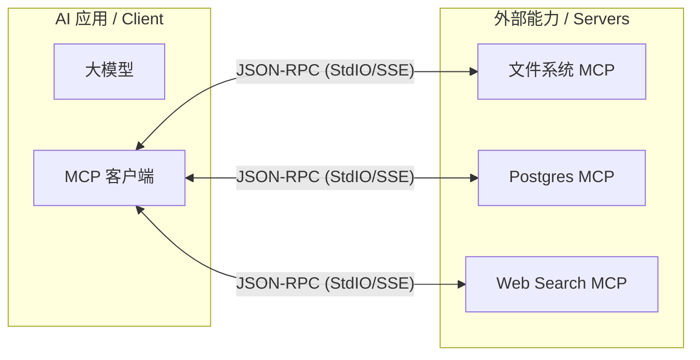

# Model Context Protocol (MCP) 技术学习指南

> 创建日期: 2026-01-26
> 适用项目: ai_worker

本文档旨在帮助开发者深入理解 MCP 协议的核心概念、技术实现以及 FastMCP 的工作原理。

---

## 1. 什么是 MCP？(The "USB-C" for AI)

Model Context Protocol (MCP) 是一个开放标准，用于连接 **AI 模型 (Hosts)** 和 **数据/工具 (Servers)**。

### 核心架构
MCP 采用 **Client-Host-Server** 架构（在简单场景下 Client 和 Host 通常是同一个进程，比如我们的 `ai_worker`）。



### 三大核心原语 (Primitives)
1.  **Tools (工具)**: 也就是函数调用。模型可以调用 Server 提供的函数（我们目前主要用的这个）。
2.  **Resources (资源)**: 类似于文件读取。Server 暴露数据，Client 直接读取，无需参数（如：读取日志文件、数据库表结构）。
3.  **Prompts (提示词)**: Server 可以预定义 Prompt 模板，供 Client 直接使用。

---

## 2. 为什么选择 FastMCP？

在 Python 生态中，实现 MCP Server 有两种方式：

### 方式 A: Low-Level API (`mcp.server.Server`)
这是 SDK 的底层实现，虽然灵活但极其繁琐。你需要：
*   手动定义 JSON Schema。
*   手动管理 Request/Response 生命周期。
*   手动处理异常和错误码。

**代码示例 (不推荐)**:
```python
# 繁琐的写法
server = Server("demo")

@server.list_tools()
async def handle_list_tools() -> list[types.Tool]:
    return [
        types.Tool(
            name="add",
            description="Add two numbers",
            inputSchema={
                "type": "object",
                "properties": {
                    "a": {"type": "integer"},
                    "b": {"type": "integer"}
                },
                "required": ["a", "b"]
            }
        )
    ]
```

### 方式 B: High-Level API (`mcp.server.fastmcp.FastMCP`)
这是官方推荐的“生产级”写法，灵感来源于 `FastAPI`。

**优势**:
1.  **自动 Schema 生成**: 利用 Python 的 Type Hints (`str`, `int`, `pydantic models`) 自动生成 JSON Schema。
2.  **装饰器驱动**: `@mcp.tool()` 一键注册。
3.  **内置生命周期**: 自动处理连接握手、心跳和错误捕获。

**代码示例 (我们用的写法)**:
```python
from mcp.server.fastmcp import FastMCP

mcp = FastMCP("demo")

@mcp.tool()
async def add(a: int, b: int) -> int:
    """Add two numbers"""  # Docstring 会自动变成工具描述
    return a + b
```

---

## 3. 技术实现细节

### 通信传输 (Transports)
MCP 支持两种主要的传输方式：

1.  **StdIO (标准输入输出)**:
    *   **原理**: Client 启动 Server 作为一个子进程 (`subprocess`)。
    *   **通信**: 通过 `stdin` 写指令，通过 `stdout` 读结果。
    *   **场景**: 本地工具（如读写本地文件、执行本地脚本）。`ai_worker` 目前默认使用这种方式。
    *   **优点**: 安全、简单，无需网络配置。

2.  **SSE (Server-Sent Events) over HTTP**:
    *   **原理**: 建立 HTTP 长连接。
    *   **场景**: 远程工具（如连接部署在云端的数据库 Agent）。
    *   **优点**: 可以跨网络调用。

### 类型映射 (Type Mapping)
`FastMCP` 依靠 Python 类型提示来生成规范：

| Python Type | JSON Schema Type |
| :--- | :--- |
| `str` | `string` |
| `int` | `integer` |
| `float` | `number` |
| `bool` | `boolean` |
| `list[str]` | `array` of strings |
| `pydantic.BaseModel` | `object` (nested) |

---

## 4. 我们的架构 (`ai_worker`)

我们目前的架构正处于向标准 MCP 过渡的阶段：

1.  **Registry Layer (`registry.py`)**:
    *   作为内部的“中间人”，它负责管理 Python 类的实例化和配置注入。
    *   这层解耦了 `main.py` 和具体工具类。

2.  **MCP Server Layer (`mcp_server.py`)**:
    *   这是我们的**对外接口**。
    *   它从 Registry 获取工具实例。
    *   它使用 `FastMCP` 将 Python 函数包装成 MCP 协议标准格式。

### 未来的 Client 端实现
当我们开始做 Phase 10 (Client Manager) 时，我们将使用 `mcp.client.stdio`：

```python
# 未来的代码预览
async with stdio_client(server_params) as (read, write):
    async with ClientSession(read, write) as session:
        await session.initialize()
        result = await session.call_tool("web_search", arguments={"query": "hello"})
```

---

## 5. 参考资源

*   **官方文档**: https://modelcontextprotocol.io
*   **Python SDK**: https://github.com/modelcontextprotocol/python-sdk
*   **官方示例**: https://github.com/modelcontextprotocol/servers (包含 Google Drive, Slack 等官方实现)
