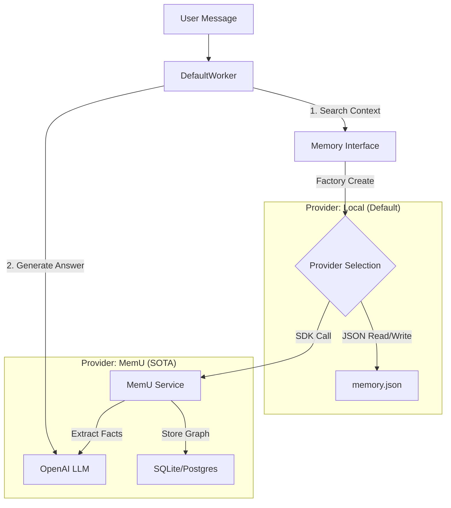

# AI Worker Memory System: Architecture & Demo

**Date**: 2026-01-30
**Status**: Implemented & Verified

## 1. System Architecture

The Memory System allows the AI Agent to store and recall long-term knowledge, user preferences, and past events. It is designed with a **Pluggable Provider Architecture**.



## 2. Component Workflow Demo

This section traces a single memory interaction ("User likes Python") through the entire stack, showing Inputs and Outputs at every stage.

### Scenario: Memorization (Ingest)

**Input**: User says *"I am building a Python agent framework called AI Worker."*

#### Step 1: DefaultWorker -> MemUProvider
The worker (or background task) calls the provider.
- **Method**: `add(content=..., user_id="u1")`
- **Action**: `MemUProvider` saves text to a temporary file (`temp/hash.txt`).

#### Step 2: MemUProvider -> MemU Service
- **Call**: `service.memorize(resource_url="temp/hash.txt", modality="text")`
- **Internal**: MemU reads the file.

#### Step 3: MemU Service -> LLM (Extraction)
MemU sends a prompt to the LLM to extract structured facts.

**LLM Input (Prompt)**:
```text
You are a memory extractor. Analyze the user's message.
Extract stable traits (Profile) and specific events (Event).
Text: "I am building a Python agent framework called AI Worker."
Output format: XML
```

**LLM Output (XML)**:
```xml
<root>
  <item>
    <memory_type>profile</memory_type>
    <summary>The user is building a Python agent framework named AI Worker.</summary>
  </item>
  <item>
    <memory_type>event</memory_type>
    <summary>User mentioned building AI Worker framework.</summary>
  </item>
</root>
```

#### Step 4: MemU Service -> Database (Categorization)
MemU embeds the summaries and links them to categories.

**DB State (Simplified)**:
- **Resource**: `id=101`, `text="I am building..."`
- **Item A**: `id=201`, `summary="User builds AI Worker"`, `type="profile"` -> Linked to Category `[Projects]`
- **Item B**: `id=202`, `summary="User mentioned..."`, `type="event"`

### Scenario: Retrieval (Recall)

**Input**: User asks *"What framework am I building?"*

#### Step 1: DefaultWorker -> MemUProvider
- **Method**: `search(query="What framework am I building?", user_id="u1")`

#### Step 2: MemUProvider -> MemU Service
- **Call**: `service.retrieve(queries=[{"role": "user", "content": "..."}])`

#### Step 3: MemU Service -> LLM/Vector (Hybrid Search)
MemU performs a multi-tier search.

1.  **Vector Search**: Embeds query. Finds Items close to "framework", "building".
    *   *Match*: Item A (`summary="User builds AI Worker"`) -> Score: 0.89
2.  **Graph Traversal**: Checks categories linked to the user.

**MemU Output (Context Object)**:
```python
{
    "items": [
        {"id": "201", "summary": "The user is building a Python agent framework named AI Worker.", "score": 0.89}
    ],
    "categories": [...]
}
```

#### Step 4: MemUProvider -> DefaultWorker
The provider converts MemU objects to standard `MemoryItem`s.

**Output (List[MemoryItem])**:
```python
[
    MemoryItem(
        content="The user is building a Python agent framework named AI Worker.",
        relevance=0.89,
        metadata={"type": "profile", "source": "memu_item"}
    )
]
```

#### Step 5: DefaultWorker -> System Prompt
The worker injects this into the context for the final answer generation.

**System Prompt Injection**:
```text
## Long Term Memory (Related Facts)
- [PROFILE] The user is building a Python agent framework named AI Worker.
```

**Final Answer**: "You are building **AI Worker**, a Python agent framework."

## 3. Configuration Guide

To switch between providers, modify `.env`:

**For Local JSON (Simple)**:
```bash
MEMORY_PROVIDER=local
```

**For MemU (SOTA)**:
```bash
MEMORY_PROVIDER=memu
OPENAI_API_KEY=sk-... (for Chat)
OPENAI_API_KEY_EMBED=sk-... (for Embeddings)
```

## 4. Dependencies
- **memu-py**: The core engine (Requires Python 3.13+).
- **openai**: For LLM calls.
- **sqlite/pydantic**: For storage.
